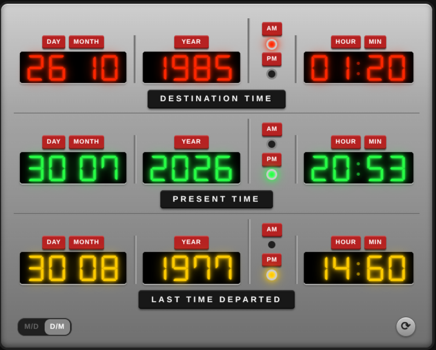

# Time Circuits Card

A Back to the Future Time Circuits replica card for [Home Assistant](https://www.home-assistant.io/).



Designed to pair with an ESP32-based Time Circuits replica that publishes its state
to Home Assistant over MQTT (auto-discovery). Renders the iconic three-row display
on a brushed-metallic surface with red Dymo-style field labels:

- **DESTINATION TIME** (top, red LEDs)
- **PRESENT TIME** (middle, green LEDs)
- **LAST TIME DEPARTED** (bottom, yellow LEDs)

Each row shows `MMDD` (or `DDMM` when the date format is set to `DM`), `YYYY`, and
`HHMM` LED segments with round AM/PM lamp indicators. The display scales to fit
the card width.

> The card automatically loads the **DSEG7 Classic** 7-segment webfont from a CDN,
> so the digits render like a real LED display (falls back to a monospace font
> if the CDN is unreachable).

## Requirements

- Home Assistant with MQTT integration configured.
- An ESP32 Time Circuits device that publishes MQTT auto-discovery messages
  (text entities for the top/bottom rows, a select for date format, and a button
  for RTC sync). The matching firmware lives in the companion project.

## Install via HACS

1. Add this repo as a custom repository in HACS (type: **Lovelace**).
2. Install **Time Circuits Card**.
3. Add the resource if not added automatically:
   ```yaml
   resources:
     - type: module
       url: /hacsfiles/TimeCircuits-Replica-Lovelace-Card/time-circuits-card.js
   ```

## Manual install

Copy `time-circuits-card.js` to your `config/www/` folder and add it as a
Lovelace resource:

```yaml
resources:
  - type: module
    url: /local/time-circuits-card.js
```

## Configuration

Use the visual editor, or define in YAML:

```yaml
type: custom:time-circuits-card
destination_entity: text.time_circuits_replica_destination_time
departed_entity: text.time_circuits_replica_last_time_departed
date_format_entity: select.time_circuits_replica_date_format
sync_entity: button.time_circuits_replica_sync_rtc_time
theme:
  background: "#0a0a0a"
  top_color: "#ff2200"
  middle_color: "#22ff44"
  bottom_color: "#ffcc00"
  accent: "#ffb011"
```

The entity IDs above are the ones the companion firmware advertises via MQTT
auto-discovery (see `object_id` in its discovery payloads). The `present_entity`
is optional — the device's middle row is RTC-driven and not published over MQTT,
so by default the card shows Home Assistant server time, updated every second.

### Options

| Key                  | Type   | Description                                                   |
| -------------------- | ------ | ------------------------------------------------------------- |
| `destination_entity` | string | `text.*` entity holding a 12-digit `MMDDYYYYHHMM` string (top row). |
| `departed_entity`    | string | `text.*` entity holding a 12-digit `MMDDYYYYHHMM` string (bottom row). |
| `present_entity`     | string | Optional `text.*` for the middle row. If omitted, the card shows HA server time, updated every second. |
| `date_format_entity` | string | Optional `select.*` returning `MD` or `DM`. Controls MMDD vs DDMM display order. A toggle switch on the card flips between the two. |
| `sync_entity`        | string | Optional `button.*` entity; the card's sync button calls `button.press`. |
| `font_family`        | string | CSS `font-family` for the LED digits. Defaults to `'DSEG7 Classic', 'Courier New', monospace`; the DSEG7 font is auto-loaded from a CDN. |
| `theme`              | object | Optional color overrides (see below).                        |

### Theme keys

| Key              | Default     | Description                          |
| ---------------- | ----------- | ------------------------------------ |
| `background`     | `#0a0a0a`   | Card background                      |
| `bezel`          | `#1a1a1a`   | Outer border                         |
| `label_color`    | `#e8e8e8`   | Row labels                           |
| `top_color`      | `#ff2200`   | Top row (Destination Time) - red     |
| `middle_color`   | `#22ff44`   | Middle row (Present Time) - green    |
| `bottom_color`   | `#ffcc00`   | Bottom row (Last Time Departed) - yellow |
| `accent`         | `#ffb011`   | Toggle / sync button accent           |

## Interaction

- Click any digit group on the top or bottom row to set that row's time. A
  single prompt asks for all fields (day, month, year, hour, minute)
  space-separated, in the order matching the current date format setting.
  The value is sent via `text.set_value`. (The stored order is always `MMDD`;
  the card applies the selected display order for rendering only.)
- The **M/D · D/M toggle** (bottom left) switches between month/day and day/month
  display order by calling `select.select_option` on the date format entity.
- The **sync button** (bottom right, silver circular) calls `button.press` on
  the configured sync entity to sync the device's RTC to NTP.

## Development

```bash
npm install
npm run build       # outputs time-circuits-card.js at repo root
npm run dev         # rebuild on save
npm run typecheck
```